## Tekton Bundles

The plugin allows working with bundles. It is possible to create a bundle containing up to 10 Tekton resources and push it to a public/private registry and 
retrieve/download any existing one. 

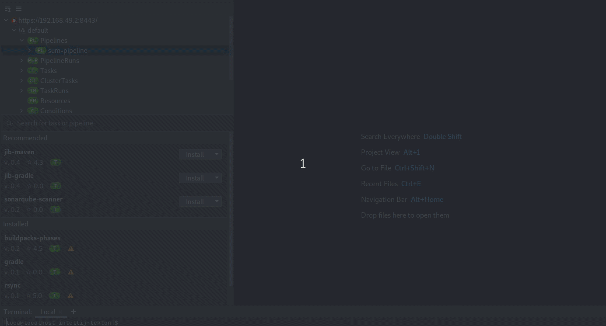

## Getting Started Page

The Getting Started page shows all the features provided by the plugin and explain how to invoke and use them 


## Tekton Hub view

The Tekton Hub was integrated through a search dialog that allows users to search to tasks and pipelines from the Tekton Hub to be added to the cluster.
The content from the Tekton Hub is now integrated into a new view that is displayed below the cluster Tekton resources and is automatically synced with the current IntelliJ project: if you working on a Java project, then only tasks and pipelines relevant for Java will be displayed:


## Leverage the Kubernetes Plugin Push/Pull toolbar

The Tekton plugin leverages the Kubernetes plugin's toolbar to push/pull resources


## Enhanced editor content analysis

When creating/opening a pipeline in the editor, it analyzes the yaml content to verify that all tasks/clustertasks used
actually exists on cluster. If not, the user is notified.

## Debug task/taskrun

A Task and/or a TaskRun can now be started in debug mode. The container where the taskrun will be executed
will be kept running even when the run fails. A terminal connected to the container will be opened so you can
interact with it and identify any possible misbehavior/error.
To use the debug feature, you must have access to a Kubernetes or OpenShift cluster with Tekton installed with a version
greater than 0.26.0 and enable alpha mode.

To enable alpha mode you can run this command
```
kubectl patch configmap/feature-flags \
  -n <namespace> \
  --type merge \
  -p '{"data":{"enable-api-fields":"alpha"}}'
```


N.B: By activating alpha mode, you will enable all features that are still in alpha and are not considered stable (e.g debug).
Be aware that you could meet some errors during commands execution.

## YAML cleanup

When a Kubernetes resource is retrieved from a cluster, its YAML content stored some internal metadata that users may not need to care about. So there is now a new command called XXX to remove it. There is also a setting so that this command is automatically executed when a Tekton resource is displayed in the editor.


## VolumeClaimTemplate support

When start a task or pipeline, it is now possible to specifiy a VolumeClaimTemplate. Also, if a PersistentVolumeClaim is chosen and needs to be created, it can be done from within the wizard.


## Refactor inline tasks as reusable tasks from the editor

It is now possible to save an inline task from a pipeline as a task or cluster task from within the pipeline editor. The inline task is saved to the cluster and replaced in the pipeline definition by a task reference.


## Find Task references

It is possible to find all references of a task within the cluster. During a deletion the user is also informed if a task is used somewhere to prevent possible errors.


## Enhanced logs

Logs have been extended to work with EventListeners and they can be now redirected into the editor


## Add Plugin preferences

It is possible to set preferences to change the default plugin behaviour, such as delete all related resources automatically or avoid showing the wizard if a pipeline/task has no inputs


## Code completion on single inputs

When adding a task to a pipeline definition, code completion gets also activated on single inputs (param, input/output resource and workspace). If the input contains a default value, then this value is also inserted into the pipeline definition.


## Pipeline execution reported as notification

When a new pipeline is started, its execution status is new reported asynchronously as a notification.

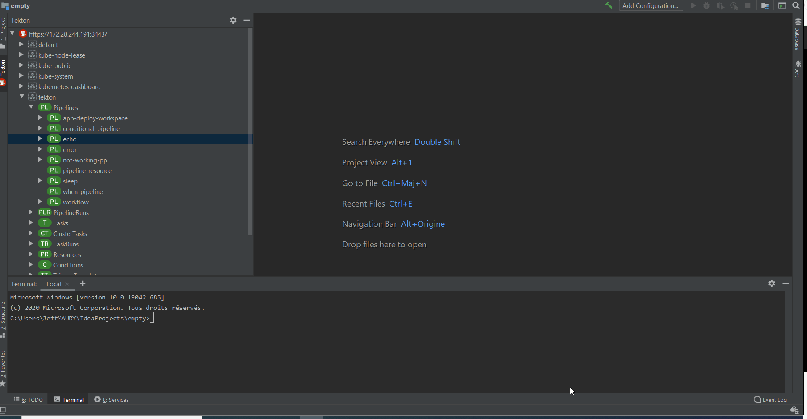

This can be turned off through a setting under **Settings -> Tools -> Tekton Pipelines by Red Hat**:

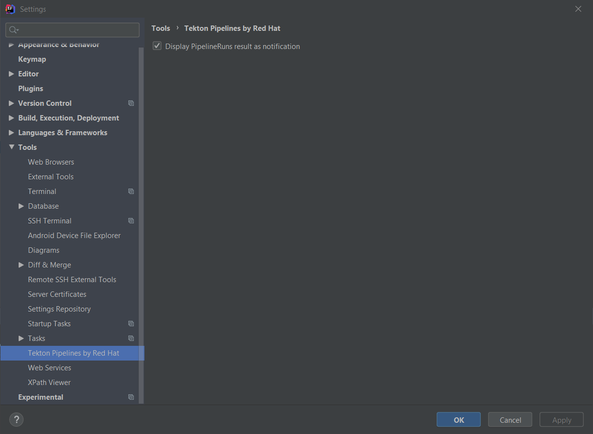

## Wrong uses of runAfter

Task ordering can be managed through the **runAfter** field. However, uses of this field is not allowed when specifying **finally** tasks. Such wrong usages will be reported when editing your pipeline through an error marker:

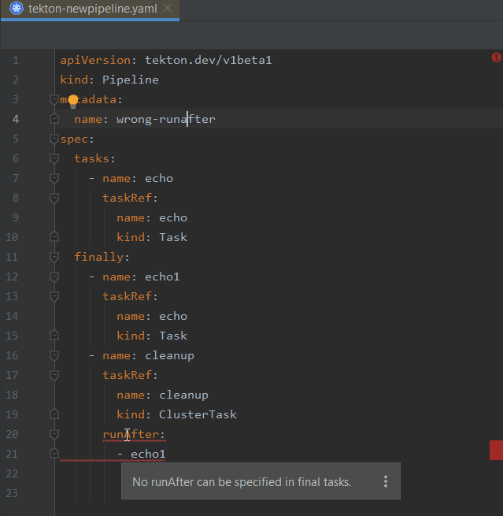

## Preview when starting a task or pipeline

When starting a task or a pipeline, it is possible to see the generated taskrun or pipelinerun payload with the **Show Preview** option:

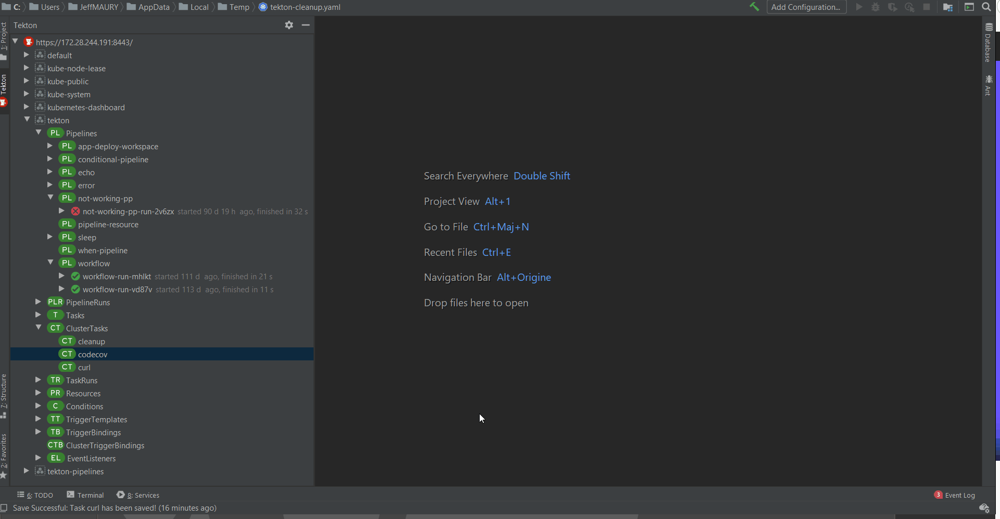
## Unused parameters / resources / workspaces

When a pipeline or task is defining parameters, resources or workspaces that are not being used in the pipeline or task definition, then this parameter, resource or workspace is grey highlighted just like an unused variable is highlighted in a classic code editor.

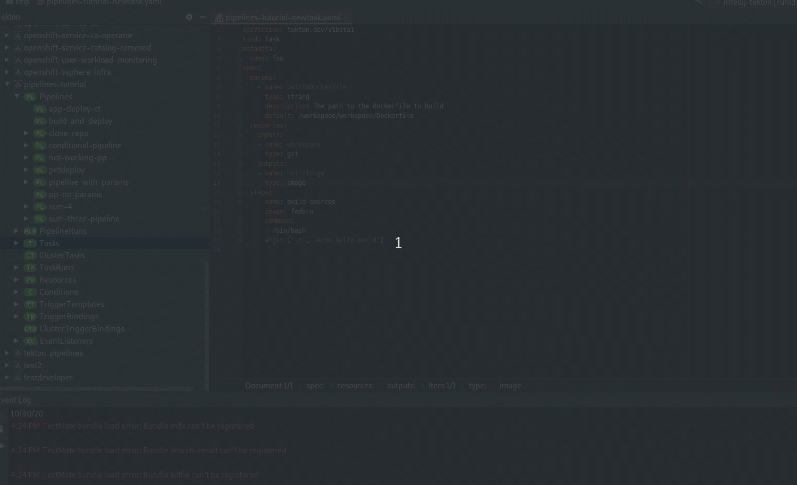
## Cluster task references

When a name of a task is to be specified in a pipeline definition, then the list of the normal tasks was provided. The list of existing cluster tasks is now available, with the **(clusterTask)** suffix to distinguish from normal tasks.

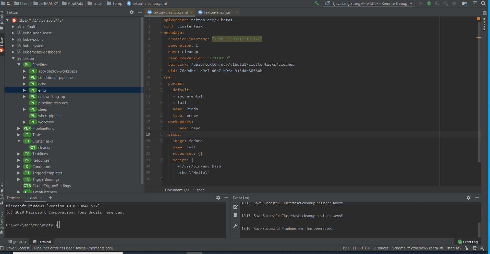

## Parameter values and workspaces

When a task is selected inside a pipeline definition during code completion, the list of parameters to be passed to this task is inserted into the pipeline definition. If the definition of a parameter contains a default value, then this value is also inserted into the pipeline definiton.
On the same topic, if the task definition contains a list of workspaces, then a list of workspaces will be inserted into the pipeline definition as well.

## Troubleshooting

Sometimes, it may be hard to understand why a pipeline failed or why it is stuck. We added a new troubleshooting tool that will inspect low level Kubernetes resources related to your task or pipeline execution and extract information that may be helpful.

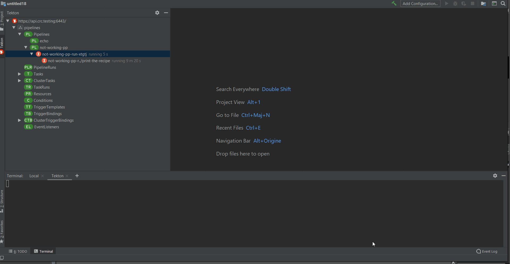

## Add trigger wizard

It is now much simple to add a trigger to an existing pipeline. We added a new wizard that allows you to associate one or more trigger bindings to a pipeline (and if you don't have bindings already, you can create it while adding the trigger).

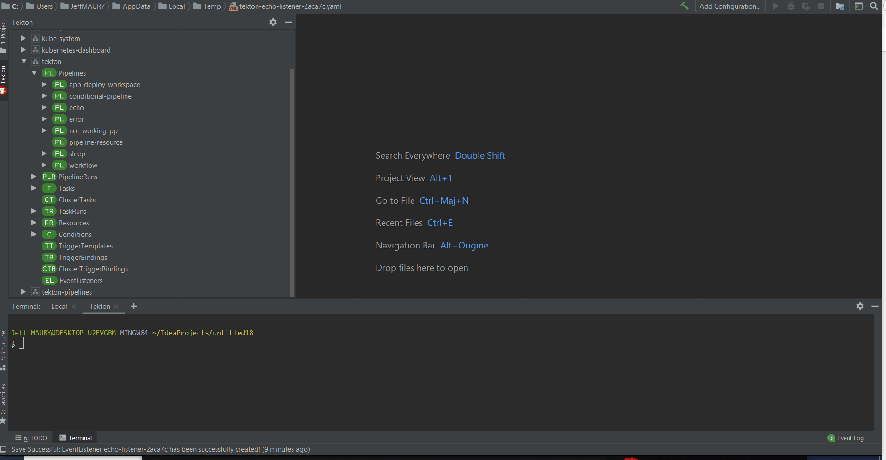

## Pipelinerun preview editor

Like the pipeline editor, the pipelinerun editor has been enhanced to include a visual representation of the pipeline
workflow and status. Conditions and finally clauses are also supported.


## Run prefix when starting a task or pipeline

It is now possible to specify a run prefix when starting a task or pipeline. This allows to better identify the execution in the set of runs


### When expressions

The dynamic input of a when expression can be easily specified as code completion can now retrieve the results from other tasks of the pipeline.


## Resource reference

Any task using input or output resources can be specified in the pipeline workflow and values for the resource field will be managed through code completion


## Pipeline preview editor

The pipeline editor has been enhanced to include a visual representation of the pipeline
workflow. Conditions and finally clauses are also supported.


### Initialize start wizard with settings from a previous run

As starting a task or pipeline may require a lot of inputs, it is also possible to start a task or pipeline using the settings from a previous run. The start wizard will have these input values initialized from the values used in the previous run instead of getting the default value.

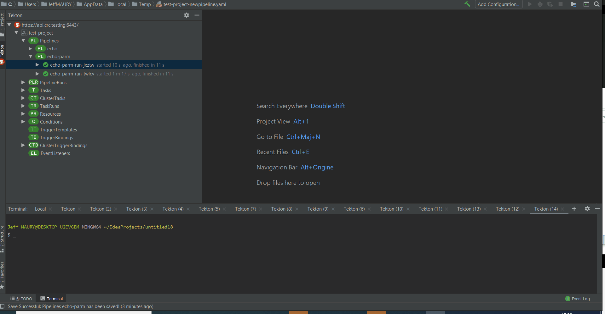

## Value references

When a parameter/workspace/resource is to be set on a task, code assist will present the candidate values.

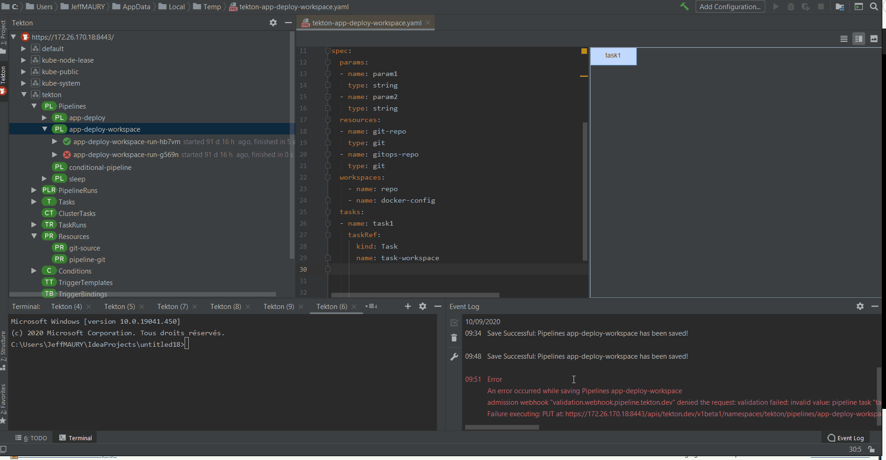

## Task graph

Tasks inside a pipeline can be sequence through the *runAfter* field. When code completion is activate on such a field, the list of available tasks in the pipeline is proposed:

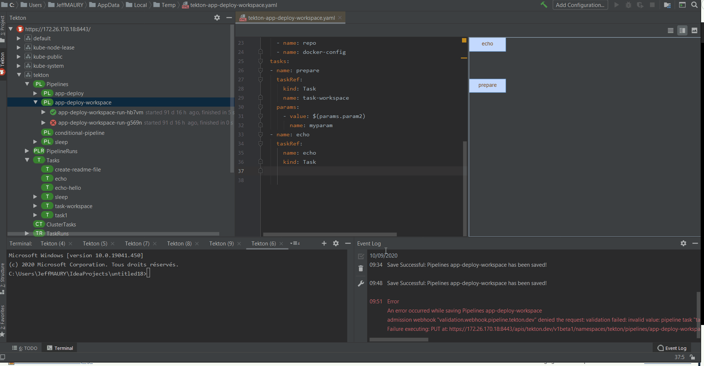

## Conditions

When a task is to be conditionnaly executed through conditions (using the *conditionRef* field), the list of available conditions is proposed:

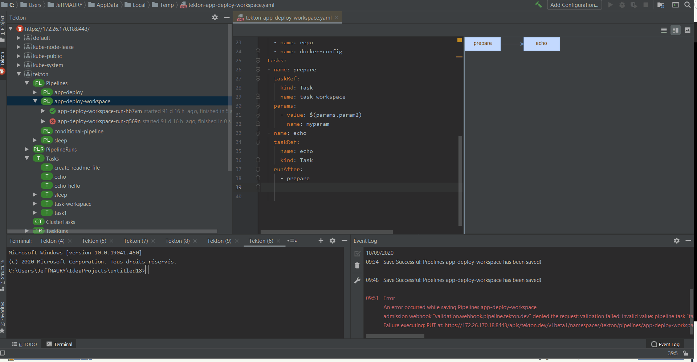
## Delete

When a task or pipeline resource is to be deleted, you now have the choice to delete associated resources (task runs / pipeline runs) through an option:


## Runs ordering

The taskruns/pipelineruns are now displayed ordered by the starting time (most recent started run is displayed first), allowing users to keep focusing on recent work


## Cancel run

A task or pipeline run still active (in the running state) can be canceled through a new Cancel action:

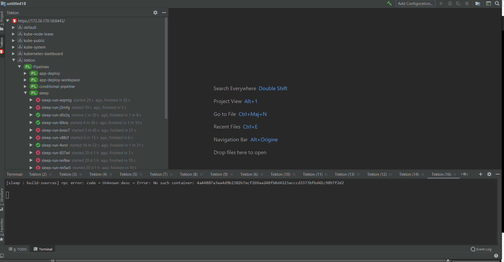

## Automatically show logs

When a task or pipeline is started, the logs view is automatically displayed
## Delete multiple elements

It is now possible to delete several different elements, even if they are of the same nature (ie task runs and pipeline runs)
## Proxy support

Communication with the cluster is now supported automatically. The plugin will honor proxy settings from IntelliJ so proxy is configured by default or if proxy is associated with the cluster API server hostname, then communication from this plugin to the cluster will go through the configured proxy.
## Tekton Triggers support

This plugin now supports the Tekton Triggers resources (if Tekton Triggers runtime is installed on the cluster):

* TriggerTemplates
* TriggerBindings
* ClusterTriggerBindings
* EventListeners

## Additional commands

The following commands have been added:

* Start Last Run (for pipelines and tasks)
* Edit any Tekton resource by double clicking on the resource in the tree

The Tekton tree now displays:

* TaskRuns
* PipelineRuns
* Conditions

as separate nodes.
## Provides easy editing support for Tekton assets (pipelines, task, ...)

Code assist and syntax validation based on JSON schemas has been added to the Tekton
resources editing experience in addition to the code snippets.

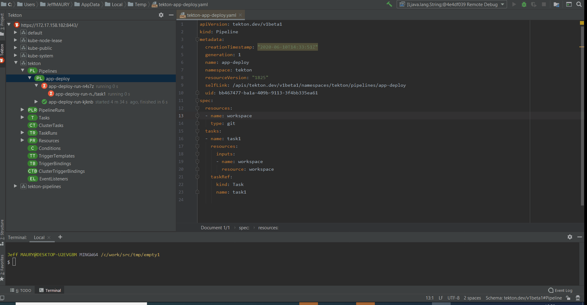

## Running Kubernetes and OpenShift Clusters to use with plugin

To use the plugin, developers can deploy `Tekton Pipelines` into a OpenShift or Kubernetes cluster. OpenShift clusters can be provisioned using the following ways:

* [OpenShift Local](https://developers.redhat.com/products/openshift-local/overview)
* [Developer Sandbox for Red Hat OpenShift](https://developers.redhat.com/developer-sandbox)
* [Red Hat OpenShift Cluster Manager](https://console.redhat.com/openshift/create/datacenter) - This 60-day, self-supported trial lets you install and run Red Hat OpenShift Container Platform on infrastructure you manage.
* [Red Hat OpenShift Dedicated](https://console.redhat.com/openshift/create/osdtrial) - Red Hat OpenShift Dedicated is a fully managed service of Red Hat OpenShift on Amazon Web Services (AWS) and Google Cloud.
* [Azure Red Hat OpenShift](http://red.ht/3oeVPjM) - Azure Red Hat OpenShift is a fully-managed service of Red Hat OpenShift on Azure, jointly engineered, managed and supported by Microsoft and Red Hat.
* [Red Hat OpenShift Service on AWS (ROSA)](https://console.redhat.com/openshift/create/rosa/wizard) - Build, deploy, and manage Kubernetes applications with Red Hat OpenShift running natively on AWS.

## Tekton Pipelines Tutorial

To get started with Tekton and learn how to create and run a simple pipeline for building and deploying containerized app on Kubernetes/OpenShift, you can follow one of these tutorials:

* [Tekton Pipelines Tutorial](https://github.com/tektoncd/pipeline/blob/master/docs/tutorial.md)
* [OpenShift Pipelines Tutorial](https://github.com/openshift/pipelines-tutorial)

## Commands and features

Development of the Tekton Pipelines Plugin is largely following development of the [tkn CLI](https://github.com/tektoncd/cli) as well as
Tekton Pipelines which are both under active development and potentially subject to drastic changes.

Below you can find a list of the current actions supported by this plugin to interact with Tekton Pipelines.
These are accessible via the context menu when right-clicking an item in the tree.

#### Actions available for a Tekton Pipeline/Task/ClusterTask/Resource

   * `New` - Open an editor with a configuration sample to create a new pipeline/task/clusterTask/resource.
   * `Open in Editor` - Open the existing pipeline/task/clusterTask/resource configuration in an editor.
   * `Start` - Start a pipeline/task with user indicated input/output resources and parameters.
   * `Delete` - Delete the selected pipeline/task/clusterTask/resource.
   * `Refresh` - Refresh the selected item
   * `Show Logs` - Show a dialog to choose the pipelineRun/taskRun to print logs for (only available for Pipeline/Task)
   * `Follow Logs` - Show a dialog to choose the pipelineRun/taskRun to follow logs for (only available for Pipeline/Task)

#### Actions available for an PipelineRun/TaskRun

   * `Show Logs` - Print logs for the selected PipelineRun/TaskRun
   * `Follow Logs` - Follow logs for the selected PipelineRun/TaskRun

##### Saving Process

The plugin takes advantage of the normal saving workflow of the IntelliJ IDE. When you finish to edit your configuration
and want to push the changes to the cluster, click on `Save All (CTRL + S)`. A prompt will be shown asking if you want to push the changes.
