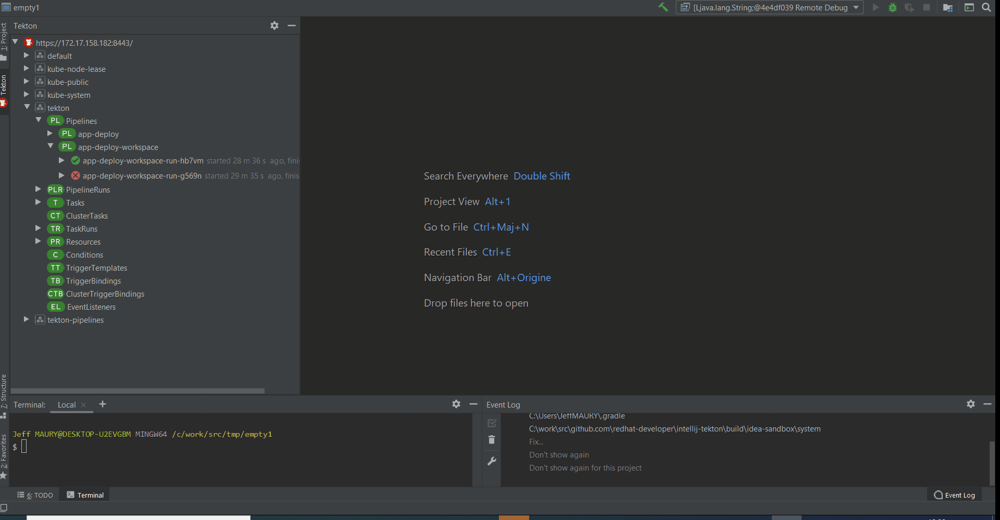

# IntelliJ Tekton
[plugin-repo]: https://plugins.jetbrains.com/plugin/14096-tekton-pipelines-by-red-hat
[plugin-version-svg]: https://img.shields.io/jetbrains/plugin/v/14096-tekton-pipelines-by-red-hat.svg
[plugin-downloads-svg]: https://img.shields.io/jetbrains/plugin/d/14096-tekton-pipelines-by-red-hat.svg

[![JetBrains plugins][plugin-version-svg]][plugin-repo]
[![JetBrains plugins][plugin-downloads-svg]][plugin-repo]

## Overview

A JetBrains IntelliJ plugin for interacting with Tekton Pipelines. This plugin is currently in Preview Mode.

## New and Noteworthy

This new release is based on v1beta1. Although it still supports v1alpha1 resources (resources, conditions), we do not support v1alpha1 version for resources that have v1beta1.

The Tekton CLI in use has been upgrated to 0.9.0.

### Enhanced start wizard (for pipelines and tasks)

The start wizard has been enhanced to support:

* workspaces
* service accounts

### Tekton Triggers support

This plugin now supports the Tekton Triggers resources (if Tekton Triggers runtime is installed on the cluster):

* TriggerTemplates
* TriggerBindings
* ClusterTriggerBindings
* EventListeners

### Additional commands

The following commands have been added:

* Start Last Run (for pipelines and tasks)
* Edit any Tekton resource by double clicking on the resource in the tree

The Tekton tree now displays:

* TaskRuns
* PipelineRuns
* Conditions

as separate nodes.

### Provides easy editing support for Tekton assets (pipelines, task, ...)

Code assist and syntax validation based on JSON schemas has been added to the Tekton
resources editing experience in addition to the code snippets.

### Running Kubernetes and OpenShift Clusters to use with plugin

To use the plugin, developers can deploy Tekton Pipelines into a Red Hat CodeReady Containers or Minikube instance.

* OpenShift 4.x - [CodeReadyContainers](https://cloud.redhat.com/openshift/install/crc/installer-provisioned)
* Kubernetes - [Minikube](https://kubernetes.io/docs/tasks/tools/install-minikube/).

The plugin also supports OpenShift running on Azure, AWS. 

## Tekton Pipelines Tutorial

To get started with Tekton and learn how to create and run a simple pipeline for building and deploying containerized app on Kubernetes/OpenShift 
you can follow one of these tutorials:

* [Tekton Pipelines Tutorial](https://github.com/tektoncd/pipeline/blob/master/docs/tutorial.md)
* [OpenShift Pipelines Tutorial](https://github.com/openshift/pipelines-tutorial)

## Commands and features

Development of the Tekton Pipelines Plugin is largely following development of the [tkn CLI](https://github.com/tektoncd/cli) as well as 
Tekton Pipelines which are both under active development and potentially subject to drastic changes.

Below you can find a list of the current actions supported by this plugin to interact with Tekton Pipelines. 
These are accessible via the context menu when right-clicking an item in the tree.

#### Actions available for a Tekton Pipeline/Task/ClusterTask/Resource

   * `New` - Open an editor with a configuration sample to create a new pipeline/task/clusterTask/resource.
   * `Open in Editor` - Open the existing pipeline/task/clusterTask/resource configuration in an editor.
   * `Start` - Start a pipeline/task with user indicated input/output resources and parameters.
   * `Delete` - Delete the selected pipeline/task/clusterTask/resource.
   * `Refresh` - Refresh the selected item
   * `Show Logs` - Show a dialog to choose the pipelineRun/taskRun to print logs for (only available for Pipeline/Task)
   * `Follow Logs` - Show a dialog to choose the pipelineRun/taskRun to follow logs for (only available for Pipeline/Task)

#### Actions available for an PipelineRun/TaskRun

   * `Show Logs` - Print logs for the selected PipelineRun/TaskRun
   * `Follow Logs` - Follow logs for the selected PipelineRun/TaskRun

##### Saving Process

The plugin takes advantage of the normal saving workflow of the IntelliJ IDE. When you finish to edit your configuration
and want to push the changes to the cluster, click on `Save All (CTRL + S)`. A prompt will be shown asking if you want to push the changes.

### Dependencies

#### CLI Tools

This plugin uses a CLI tool to interact with Tekton Pipelines:
* Tekton CLI - [tkn](https://github.com/tektoncd/cli)

> The plugin will detect these dependencies and prompt the user to install if they are missing or have not supported version - choose `Download & Install` when you see an notification for the missing tool.

**NOTE:** This plugin is in Preview mode. The plugin support for Tekton is strictly experimental - assumptions may break, commands and behavior may change!

## Release notes

See the change log.

Contributing
============
This is an open source project open to anyone. This project welcomes contributions and suggestions!

For information on getting started, refer to the [CONTRIBUTING instructions](CONTRIBUTING.md).

Feedback & Questions
====================
If you discover an issue please file a bug and we will fix it as soon as possible.
* File a bug in [GitHub Issues](https://github.com/redhat-developer/intellij-tekton/issues).

License
=======
EPL 2.0, See [LICENSE](LICENSE) for more information.
