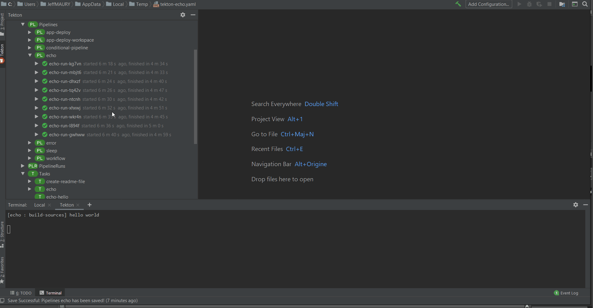
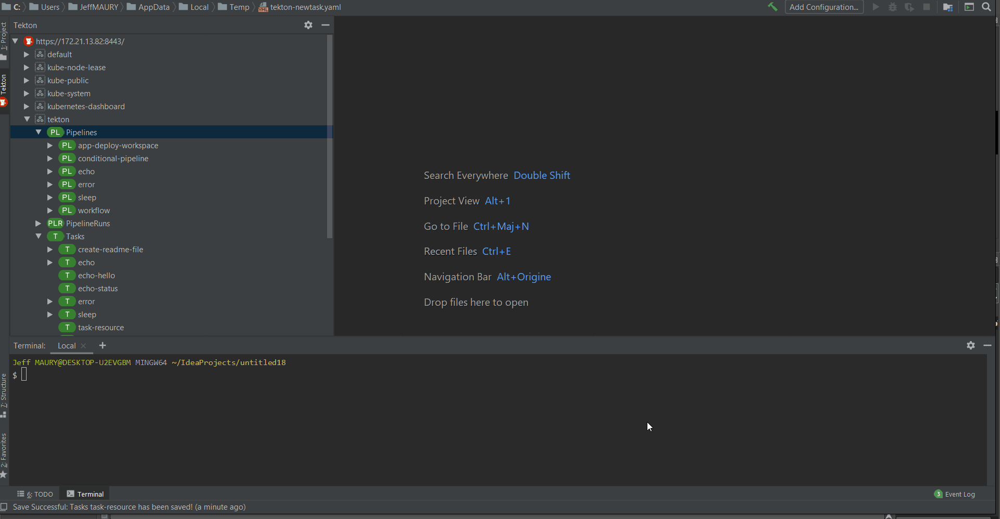

# IntelliJ Tekton
[plugin-repo]: https://plugins.jetbrains.com/plugin/14096-tekton-pipelines-by-red-hat
[plugin-version-svg]: https://img.shields.io/jetbrains/plugin/v/14096-tekton-pipelines-by-red-hat.svg
[plugin-downloads-svg]: https://img.shields.io/jetbrains/plugin/d/14096-tekton-pipelines-by-red-hat.svg

[![JetBrains plugins][plugin-version-svg]][plugin-repo]
[![JetBrains plugins][plugin-downloads-svg]][plugin-repo]

## Overview

A JetBrains IntelliJ plugin for interacting with Tekton Pipelines. This plugin is currently in Preview Mode.

## New and Noteworthy

This new release is based on v1beta1. Although it still supports v1alpha1 resources (resources, conditions), we do not support v1alpha1 version for resources that have v1beta1.

The Tekton CLI in use has been upgrated to 0.11.0 (as 0.12.0 has some performance issues).

### Pipeline preview editor

The pipeline editor has been enhanced to include a visual representation of the pipeline
workflow. Conditions and finally clauses are also supported.

### Reviewed start wizard (for pipelines and tasks)

The start wizard has been completely reviewed to better represent the current state:

#### Initialize start wizard with settings from a previous  run

As starting a task or pipeline may require a lot of inputs, it is also possible to start a task or pipeline using the settings from a previous run. The start wizard will have these input values initialized from the values used in the previous run instead of getting the default value.

### Improved code assist

#### Value references

When a parameter/workspace/resource is to be set on a task, code assist will present the candidate values.

#### Task graph

Tasks inside a pipeline can be sequence through the *runAfter* field. When code completion is activate on such a field, the list of available tasks in the pipeline is proposed:

#### Conditions

When a task is to be conditionnaly executed through conditions (using the *conditionRef* field), the list of available conditions is proposed:

### UI enhancements

#### Delete

When a task or pipeline resource is to be deleted, you now have the choice to delete associated resources (task runs / pipeline runs) through an option:

#### Runs ordering

The taskruns/pipelineruns are now displayed ordered by the starting time (most recent started run is displayed first), allowing users to keep focusing on recent work

#### Cancel run

A task or pipeline run still active (in the running state) can be canceled through a new Cancel action:

#### Automatically show logs

When a task or pipeline is started, the logs view is automatically displayed

#### Delete multiple elements

It is now possible to delete several different elements, even if they are of the same nature (ie task runs and pipeline runs)

#### Read only editor

Task runs and pipeline runs are now opened as read only in the editor

### Proxy support

Communication with the cluster is now supported automatically. The plugin will honor proxy settings from IntelliJ so proxy is configured by default or if proxy is associated with the cluster API server hostname, then communication from this plugin to the cluster will go through the configured proxy.

## Previous releases

### Tekton Triggers support

This plugin now supports the Tekton Triggers resources (if Tekton Triggers runtime is installed on the cluster):

* TriggerTemplates
* TriggerBindings
* ClusterTriggerBindings
* EventListeners

### Additional commands

The following commands have been added:

* Start Last Run (for pipelines and tasks)
* Edit any Tekton resource by double clicking on the resource in the tree

The Tekton tree now displays:

* TaskRuns
* PipelineRuns
* Conditions

as separate nodes.

### Provides easy editing support for Tekton assets (pipelines, task, ...)

Code assist and syntax validation based on JSON schemas has been added to the Tekton
resources editing experience in addition to the code snippets.

### Running Kubernetes and OpenShift Clusters to use with plugin

To use the plugin, developers can deploy Tekton Pipelines into a Red Hat CodeReady Containers or Minikube instance.

* OpenShift 4.x - [CodeReadyContainers](https://cloud.redhat.com/openshift/install/crc/installer-provisioned)
* Kubernetes - [Minikube](https://kubernetes.io/docs/tasks/tools/install-minikube/).

The plugin also supports OpenShift running on Azure, AWS. 

## Tekton Pipelines Tutorial

To get started with Tekton and learn how to create and run a simple pipeline for building and deploying containerized app on Kubernetes/OpenShift 
you can follow one of these tutorials:

* [Tekton Pipelines Tutorial](https://github.com/tektoncd/pipeline/blob/master/docs/tutorial.md)
* [OpenShift Pipelines Tutorial](https://github.com/openshift/pipelines-tutorial)

## Commands and features

Development of the Tekton Pipelines Plugin is largely following development of the [tkn CLI](https://github.com/tektoncd/cli) as well as 
Tekton Pipelines which are both under active development and potentially subject to drastic changes.

Below you can find a list of the current actions supported by this plugin to interact with Tekton Pipelines. 
These are accessible via the context menu when right-clicking an item in the tree.

#### Actions available for a Tekton Pipeline/Task/ClusterTask/Resource

   * `New` - Open an editor with a configuration sample to create a new pipeline/task/clusterTask/resource.
   * `Open in Editor` - Open the existing pipeline/task/clusterTask/resource configuration in an editor.
   * `Start` - Start a pipeline/task with user indicated input/output resources and parameters.
   * `Delete` - Delete the selected pipeline/task/clusterTask/resource.
   * `Refresh` - Refresh the selected item
   * `Show Logs` - Show a dialog to choose the pipelineRun/taskRun to print logs for (only available for Pipeline/Task)
   * `Follow Logs` - Show a dialog to choose the pipelineRun/taskRun to follow logs for (only available for Pipeline/Task)

#### Actions available for an PipelineRun/TaskRun

   * `Show Logs` - Print logs for the selected PipelineRun/TaskRun
   * `Follow Logs` - Follow logs for the selected PipelineRun/TaskRun

##### Saving Process

The plugin takes advantage of the normal saving workflow of the IntelliJ IDE. When you finish to edit your configuration
and want to push the changes to the cluster, click on `Save All (CTRL + S)`. A prompt will be shown asking if you want to push the changes.

### Dependencies

#### CLI Tools

This plugin uses a CLI tool to interact with Tekton Pipelines:
* Tekton CLI - [tkn](https://github.com/tektoncd/cli)

> The plugin will detect these dependencies and prompt the user to install if they are missing or have not supported version - choose `Download & Install` when you see an notification for the missing tool.

**NOTE:** This plugin is in Preview mode. The plugin support for Tekton is strictly experimental - assumptions may break, commands and behavior may change!

## Release notes

See the change log.

Contributing
============
This is an open source project open to anyone. This project welcomes contributions and suggestions!

For information on getting started, refer to the [CONTRIBUTING instructions](CONTRIBUTING.md).

Feedback & Questions
====================
If you discover an issue please file a bug and we will fix it as soon as possible.
* File a bug in [GitHub Issues](https://github.com/redhat-developer/intellij-tekton/issues).

If you want to chat with us, you can contact us on the `#ide-integration` channel of the `tektoncd` Slack. Please click this [link](https://join.slack.com/t/tektoncd/shared_invite/enQtNjQ1NjQzNTQ3MDQwLTc5MWU4ODg3MGJiYjllZjlmMWI0YWFlMzJjMTkyZGEyMTFhYzY1ZTkzZGU0M2I3NGEyYjU2YzNhOTE4OWQyZTM) to join the `tektoncd` Slack.

License
=======
EPL 2.0, See [LICENSE](LICENSE) for more information.
